# Task Manager Application

Task Manager is a role-based Flutter application that allows users to manage tasks with different levels of permissions based on their roles. The application utilizes various Flutter packages for state management, navigation, and responsive UI.

## Features

### Admin

- **CRUD Operations:**
  - Create, Read, Update, and Delete tasks.
- **Full Access:**
  - Access all features and functionality of the application.
- **Feedback:**
  - Provide feedback on tasks.

### Manager

- **Task Management:**
  - Create, Read, and Update tasks (limited to editing, not deletion).
- **Access Management:**
  - Access features related to managing tasks.
- **Feedback:**
  - Provide feedback on tasks.

### User

- **Read-Only Access:**
  - View tasks without create, update, or delete permissions.
- **View and Provide Feedback:**
  - Access features for viewing tasks and providing feedback.

## Technologies Used

- **State Management:** Shared Preferences
- **Responsive UI:** Screen Utils
- **Navigation:** GetX
- **Architecture:** Clean Architecture
- **Folder Structure:** Modularized code in separate folders

## Getting Started

1. Clone the repository:

```bash
git clone https://github.com/osmughal01/ezi-manager.git
```
2. Install dependencies: flutter pub get
  
3. Run the application: flutter run

## Screenshots
<table>
  <tr>
    <td align="center">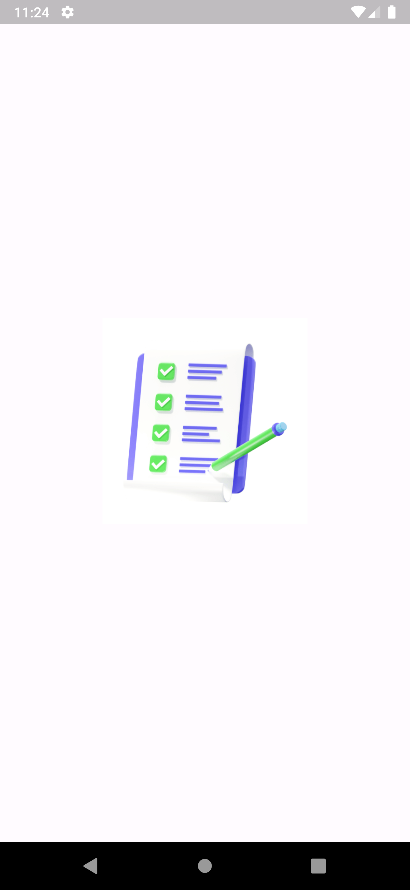</td>
    <td align="center">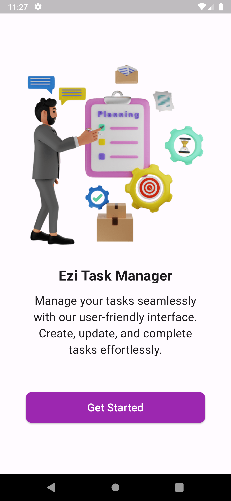</td>
    <td align="center"></td>
  </tr>
  <tr>
    <td align="center">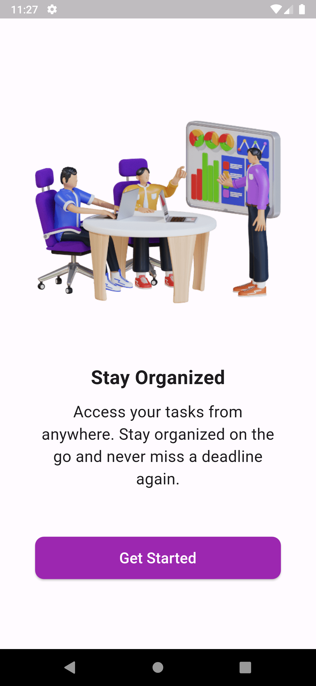</td>
    <td align="center">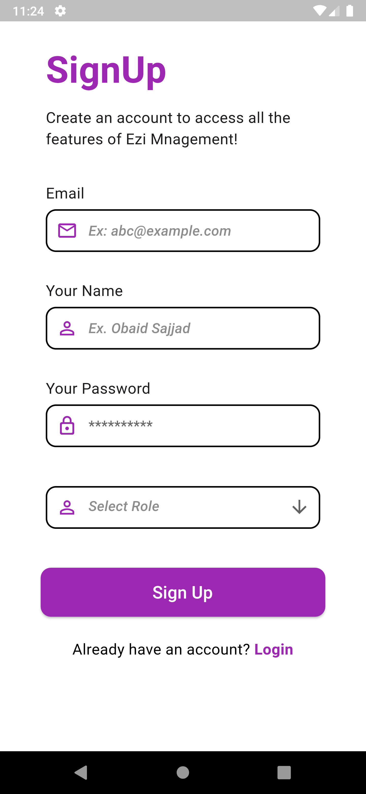</td>
    <td align="center">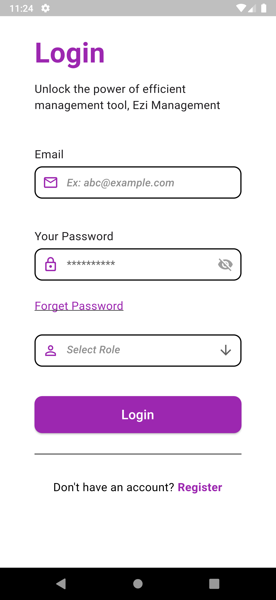</td>
  </tr>
  <tr>
    <td align="center">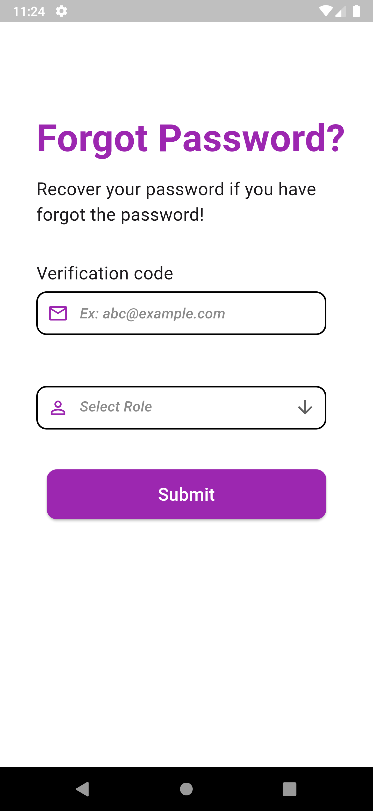</td>
    <td align="center">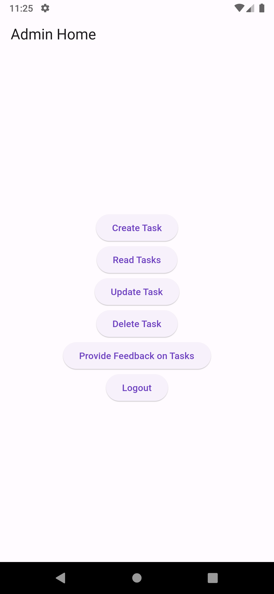</td>
    <td align="center">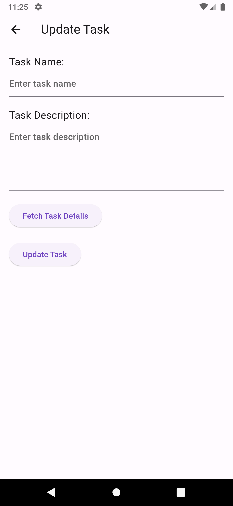</td>
  </tr>
  <tr>
    <td align="center">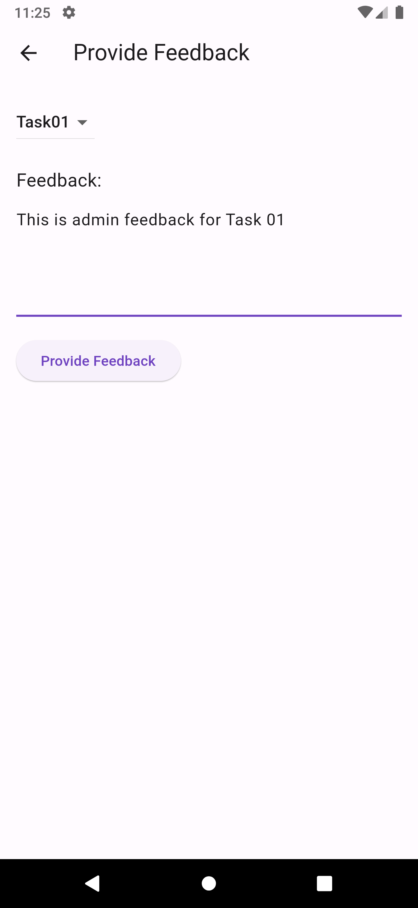</td>
    <td align="center">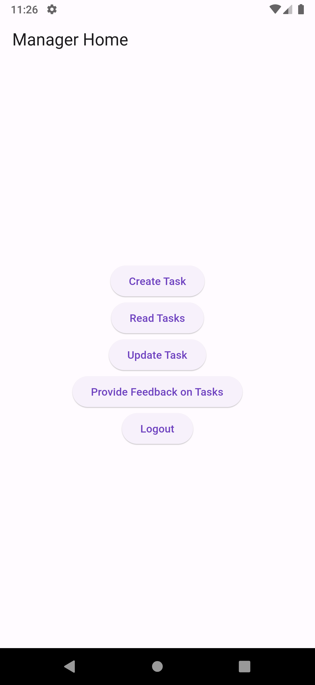</td>
    <td align="center">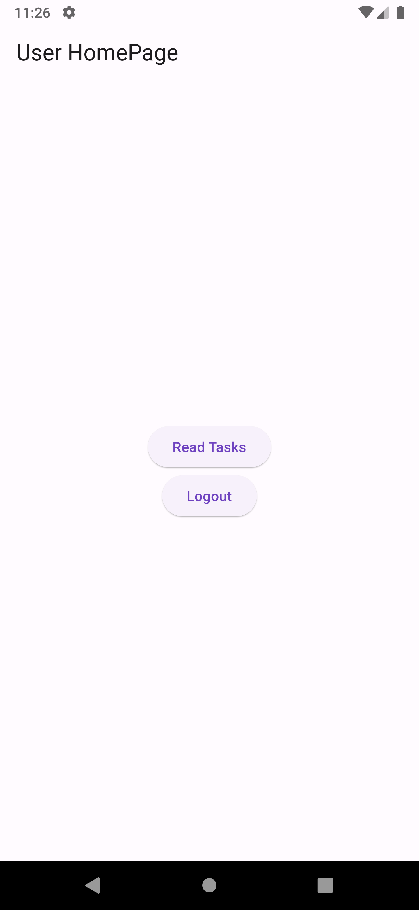</td>
  </tr>
  <tr>
    <td align="center">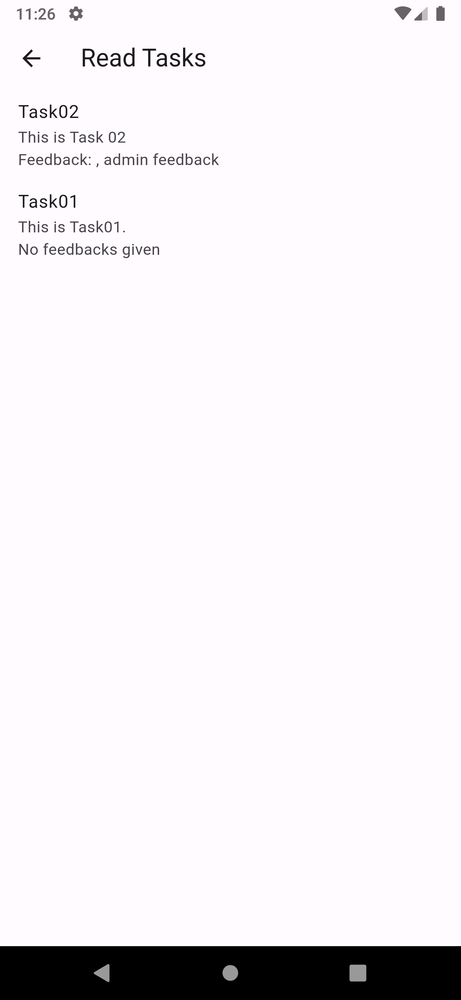</td>
  </tr>
</table>

## Contributing
If you want to contribute to this project, follow these steps:

### Fork the repository.
### Create a new branch for your feature: git checkout -b feature-name
### Commit your changes: git commit -m 'Add some feature'
### Push to the branch: git push origin feature-name
### Submit a pull request.

##License
This project is licensed under the MIT License.

